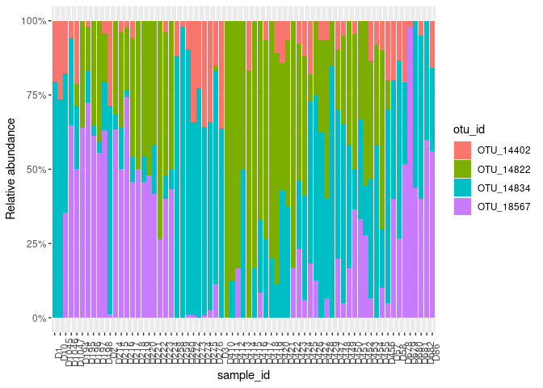
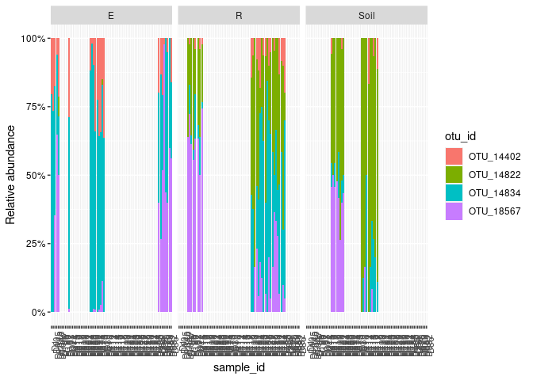
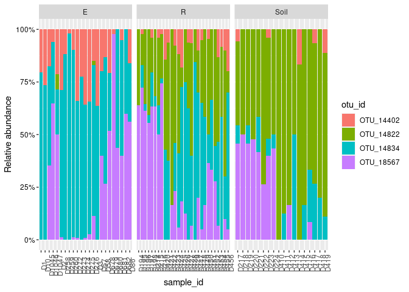
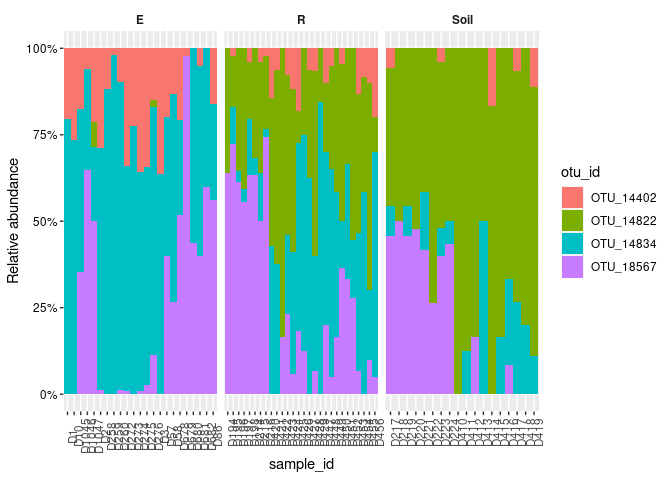
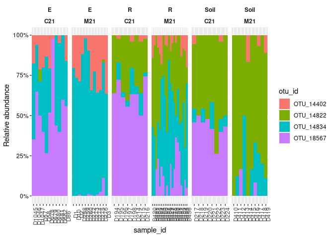
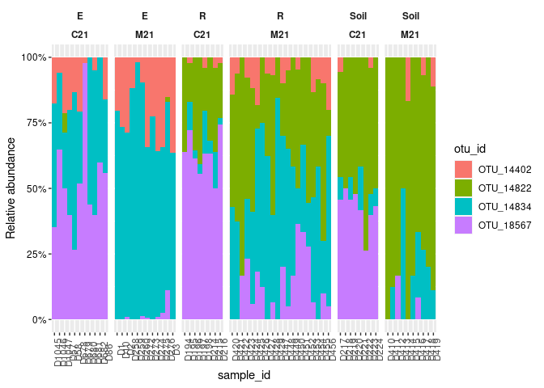
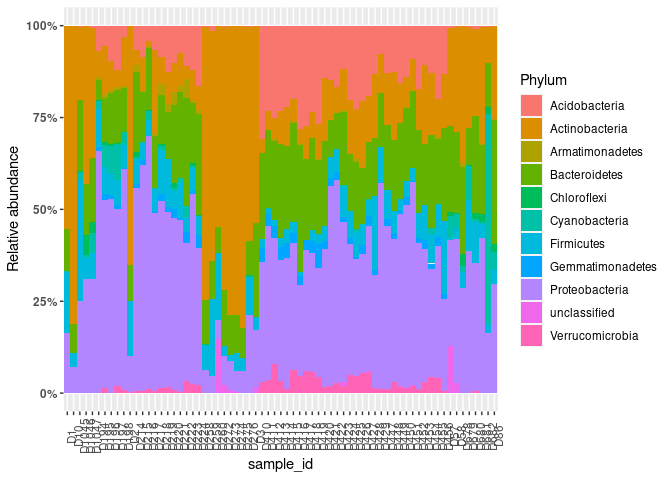
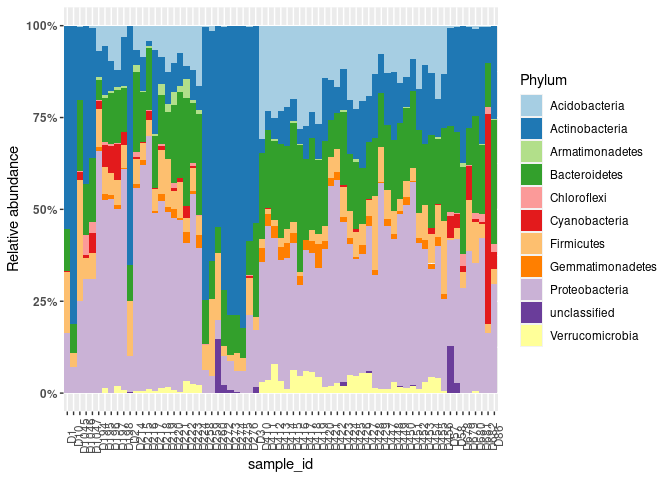
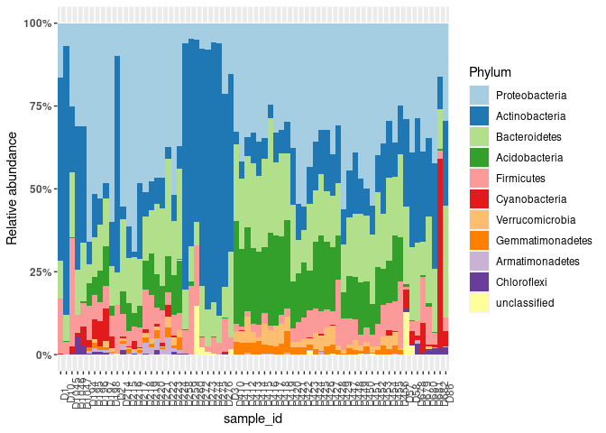
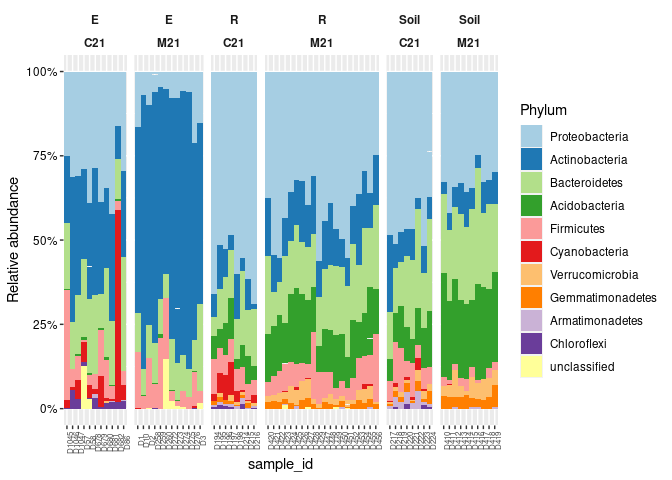

Plotting the distribution of taxa
================
Sur Herrera Paredes
2022-05-24

-   [Read data](#read-data)
-   [Basic barplot](#basic-barplot)
-   [Adding sample metadata](#adding-sample-metadata)
    -   [Excercise 1](#excercise-1)
    -   [Excercise 2](#excercise-2)
-   [Adding OTU taxonomy](#adding-otu-taxonomy)
-   [Combining sample metadata and OTU
    taxonomy](#combining-sample-metadata-and-otu-taxonomy)
-   [Extra excercises](#extra-excercises)
-   [Session info](#session-info)

``` r
library(tidyverse)
```

    ## ── Attaching packages ─────────────────────────────────────── tidyverse 1.3.1 ──

    ## ✓ ggplot2 3.3.5     ✓ purrr   0.3.4
    ## ✓ tibble  3.1.6     ✓ dplyr   1.0.8
    ## ✓ tidyr   1.2.0     ✓ stringr 1.4.0
    ## ✓ readr   2.1.2     ✓ forcats 0.5.1

    ## ── Conflicts ────────────────────────────────────────── tidyverse_conflicts() ──
    ## x dplyr::filter() masks stats::filter()
    ## x dplyr::lag()    masks stats::lag()

# Read data

``` r
Tab <- read_tsv("data/rhizo/otu_table.tsv")
```

    ## Rows: 129 Columns: 70
    ## ── Column specification ────────────────────────────────────────────────────────
    ## Delimiter: "\t"
    ## chr  (1): otu_id
    ## dbl (69): D1, D2, D3, D10, D57, D58, D86, D194, D195, D196, D197, D198, D214...
    ## 
    ## ℹ Use `spec()` to retrieve the full column specification for this data.
    ## ℹ Specify the column types or set `show_col_types = FALSE` to quiet this message.

``` r
Tab
```

    ## # A tibble: 129 × 70
    ##    otu_id       D1    D2    D3   D10   D57   D58   D86  D194  D195  D196  D197
    ##    <chr>     <dbl> <dbl> <dbl> <dbl> <dbl> <dbl> <dbl> <dbl> <dbl> <dbl> <dbl>
    ##  1 OTU_14834    39    66    56   125     4    18     7     0     5     1     1
    ##  2 OTU_18567     0     1     0     0     4     8    14    16    34    19    15
    ##  3 OTU_14402    10    27    32    45     2     4     4     0     1     0     0
    ##  4 OTU_14822     0     0     0     0     0     0     0     9     7    11    11
    ##  5 OTU_16757     0     0     0     0     0     0     0     8    10    12    10
    ##  6 OTU_15154     1     3     2     3     3     3     3     8    18    16     4
    ##  7 OTU_7054     16     8     4     7     1     0     6     2     9     4     8
    ##  8 OTU_1196      3     1     0     0     5     2    12    11    16    18     8
    ##  9 OTU_18954     0     0     0     0     0     0     1     5     7     2     4
    ## 10 OTU_14839     0     1     0     0     0     1     3     9    16    16     6
    ## # … with 119 more rows, and 58 more variables: D198 <dbl>, D214 <dbl>,
    ## #   D215 <dbl>, D216 <dbl>, D217 <dbl>, D218 <dbl>, D219 <dbl>, D220 <dbl>,
    ## #   D221 <dbl>, D222 <dbl>, D223 <dbl>, D224 <dbl>, D258 <dbl>, D259 <dbl>,
    ## #   D260 <dbl>, D272 <dbl>, D273 <dbl>, D274 <dbl>, D275 <dbl>, D276 <dbl>,
    ## #   D410 <dbl>, D411 <dbl>, D412 <dbl>, D413 <dbl>, D414 <dbl>, D415 <dbl>,
    ## #   D416 <dbl>, D417 <dbl>, D418 <dbl>, D419 <dbl>, D420 <dbl>, D421 <dbl>,
    ## #   D422 <dbl>, D423 <dbl>, D424 <dbl>, D425 <dbl>, D426 <dbl>, D427 <dbl>, …

``` r
Tab <- read_tsv("data/rhizo/otu_table.tsv",
                col_types = cols(otu_id = col_character(),
                                 .default = col_number()))
Tab
```

    ## # A tibble: 129 × 70
    ##    otu_id       D1    D2    D3   D10   D57   D58   D86  D194  D195  D196  D197
    ##    <chr>     <dbl> <dbl> <dbl> <dbl> <dbl> <dbl> <dbl> <dbl> <dbl> <dbl> <dbl>
    ##  1 OTU_14834    39    66    56   125     4    18     7     0     5     1     1
    ##  2 OTU_18567     0     1     0     0     4     8    14    16    34    19    15
    ##  3 OTU_14402    10    27    32    45     2     4     4     0     1     0     0
    ##  4 OTU_14822     0     0     0     0     0     0     0     9     7    11    11
    ##  5 OTU_16757     0     0     0     0     0     0     0     8    10    12    10
    ##  6 OTU_15154     1     3     2     3     3     3     3     8    18    16     4
    ##  7 OTU_7054     16     8     4     7     1     0     6     2     9     4     8
    ##  8 OTU_1196      3     1     0     0     5     2    12    11    16    18     8
    ##  9 OTU_18954     0     0     0     0     0     0     1     5     7     2     4
    ## 10 OTU_14839     0     1     0     0     0     1     3     9    16    16     6
    ## # … with 119 more rows, and 58 more variables: D198 <dbl>, D214 <dbl>,
    ## #   D215 <dbl>, D216 <dbl>, D217 <dbl>, D218 <dbl>, D219 <dbl>, D220 <dbl>,
    ## #   D221 <dbl>, D222 <dbl>, D223 <dbl>, D224 <dbl>, D258 <dbl>, D259 <dbl>,
    ## #   D260 <dbl>, D272 <dbl>, D273 <dbl>, D274 <dbl>, D275 <dbl>, D276 <dbl>,
    ## #   D410 <dbl>, D411 <dbl>, D412 <dbl>, D413 <dbl>, D414 <dbl>, D415 <dbl>,
    ## #   D416 <dbl>, D417 <dbl>, D418 <dbl>, D419 <dbl>, D420 <dbl>, D421 <dbl>,
    ## #   D422 <dbl>, D423 <dbl>, D424 <dbl>, D425 <dbl>, D426 <dbl>, D427 <dbl>, …

# Basic barplot

We need to think back to the original figure and reformat our data to
have one column for the x-axis and another for the y-axis

``` r
Tab %>%
  pivot_longer(-otu_id, names_to = "sample_id", values_to = "count")
```

    ## # A tibble: 8,901 × 3
    ##    otu_id    sample_id count
    ##    <chr>     <chr>     <dbl>
    ##  1 OTU_14834 D1           39
    ##  2 OTU_14834 D2           66
    ##  3 OTU_14834 D3           56
    ##  4 OTU_14834 D10         125
    ##  5 OTU_14834 D57           4
    ##  6 OTU_14834 D58          18
    ##  7 OTU_14834 D86           7
    ##  8 OTU_14834 D194          0
    ##  9 OTU_14834 D195          5
    ## 10 OTU_14834 D196          1
    ## # … with 8,891 more rows

Lets create a smaller subset of the data to make some basic plots

``` r
dat <- Tab %>%
  pivot_longer(-otu_id, names_to = "sample_id", values_to = "count") %>%
  filter(otu_id %in% c("OTU_14834", "OTU_18567", "OTU_14402", "OTU_14822"))
print(dat)
```

    ## # A tibble: 276 × 3
    ##    otu_id    sample_id count
    ##    <chr>     <chr>     <dbl>
    ##  1 OTU_14834 D1           39
    ##  2 OTU_14834 D2           66
    ##  3 OTU_14834 D3           56
    ##  4 OTU_14834 D10         125
    ##  5 OTU_14834 D57           4
    ##  6 OTU_14834 D58          18
    ##  7 OTU_14834 D86           7
    ##  8 OTU_14834 D194          0
    ##  9 OTU_14834 D195          5
    ## 10 OTU_14834 D196          1
    ## # … with 266 more rows

Now we create a basic barplot that shows relative abundances of the 4
selected OTUs

``` r
dat %>%
  ggplot(aes(x = sample_id, y = count)) +
  geom_bar(aes(fill = otu_id), stat = "identity", position = "fill")
```

<!-- -->

Now we re-make the plot with some beautification

``` r
dat %>%
  ggplot(aes(x = sample_id, y = count)) +
  geom_bar(aes(fill = otu_id), stat = "identity", position = "fill") +
  scale_y_continuous(name = "Relative abundance", labels = scales::percent) +
  theme(axis.text.x = element_text(angle = 90))
```

<!-- -->

# Adding sample metadata

Read sample metadata

``` r
Meta <- read_tsv("data/rhizo/sample_metadata.tsv",
                 col_types = cols(.default = col_character()))
Meta
```

    ## # A tibble: 69 × 4
    ##    sample_id soil  accession fraction
    ##    <chr>     <chr> <chr>     <chr>   
    ##  1 D1        M21   Col-0     E       
    ##  2 D2        M21   Col-0     E       
    ##  3 D3        M21   Col-0     E       
    ##  4 D10       M21   Ler-0     E       
    ##  5 D57       C21   Col-0     E       
    ##  6 D58       C21   Col-0     E       
    ##  7 D86       C21   Ler-0     E       
    ##  8 D194      C21   Col-0     R       
    ##  9 D195      C21   Col-0     R       
    ## 10 D196      C21   Col-0     R       
    ## # … with 59 more rows

We **join** our long format dataset with the sample metadata table

``` r
print(dat)
```

    ## # A tibble: 276 × 3
    ##    otu_id    sample_id count
    ##    <chr>     <chr>     <dbl>
    ##  1 OTU_14834 D1           39
    ##  2 OTU_14834 D2           66
    ##  3 OTU_14834 D3           56
    ##  4 OTU_14834 D10         125
    ##  5 OTU_14834 D57           4
    ##  6 OTU_14834 D58          18
    ##  7 OTU_14834 D86           7
    ##  8 OTU_14834 D194          0
    ##  9 OTU_14834 D195          5
    ## 10 OTU_14834 D196          1
    ## # … with 266 more rows

``` r
dat <- dat %>%
  left_join(Meta, by = "sample_id")
dat
```

    ## # A tibble: 276 × 6
    ##    otu_id    sample_id count soil  accession fraction
    ##    <chr>     <chr>     <dbl> <chr> <chr>     <chr>   
    ##  1 OTU_14834 D1           39 M21   Col-0     E       
    ##  2 OTU_14834 D2           66 M21   Col-0     E       
    ##  3 OTU_14834 D3           56 M21   Col-0     E       
    ##  4 OTU_14834 D10         125 M21   Ler-0     E       
    ##  5 OTU_14834 D57           4 C21   Col-0     E       
    ##  6 OTU_14834 D58          18 C21   Col-0     E       
    ##  7 OTU_14834 D86           7 C21   Ler-0     E       
    ##  8 OTU_14834 D194          0 C21   Col-0     R       
    ##  9 OTU_14834 D195          5 C21   Col-0     R       
    ## 10 OTU_14834 D196          1 C21   Col-0     R       
    ## # … with 266 more rows

We add facts with `facet_grid`

``` r
p1 <- dat %>%
  ggplot(aes(x = sample_id, y = count)) +
  geom_bar(aes(fill = otu_id), stat = "identity", position = "fill") +
  facet_grid(~ fraction) +
  scale_y_continuous(name = "Relative abundance", labels = scales::percent) +
  theme(axis.text.x = element_text(angle = 90),
        axis.text.y = element_text(color = "black"))
p1
```

<!-- --> We
set `scales="free_x"` to plot a different set of samples on each facet.

``` r
p1 <- dat %>%
  ggplot(aes(x = sample_id, y = count)) +
  geom_bar(aes(fill = otu_id), stat = "identity", position = "fill") +
  facet_grid(~ fraction, scales = "free_x") +
  scale_y_continuous(name = "Relative abundance", labels = scales::percent) +
  theme(axis.text.x = element_text(angle = 90),
        axis.text.y = element_text(color = "black"))
p1
```

<!-- -->

We repeat the plot with some beautification

``` r
p1 <- dat %>%
  ggplot(aes(x = sample_id, y = count)) +
  geom_bar(aes(fill = otu_id), stat = "identity", position = "fill", width = 1) +
  facet_grid(~ fraction, scales = "free_x") +
  scale_y_continuous(name = "Relative abundance", labels = scales::percent) +
  theme(axis.text.x = element_text(angle = 90),
        axis.text.y = element_text(color = "black"),
        strip.text = element_text(face = "bold"),
        strip.background = element_blank())
p1
```

<!-- --> We
can add an extra variable to the facet

``` r
p1 <- dat %>%
  ggplot(aes(x = sample_id, y = count)) +
  geom_bar(aes(fill = otu_id), stat = "identity", position = "fill", width = 1) +
  facet_grid(~ fraction + soil, scales = "free_x") +
  scale_y_continuous(name = "Relative abundance", labels = scales::percent) +
  theme(axis.text.x = element_text(angle = 90),
        axis.text.y = element_text(color = "black"),
        strip.text = element_text(face = "bold"),
        strip.background = element_blank())
p1
```

<!-- -->

``` r
p1 <- dat %>%
  ggplot(aes(x = sample_id, y = count)) +
  geom_bar(aes(fill = otu_id), stat = "identity", position = "fill", width = 1) +
  facet_grid(~ fraction + soil, scales = "free_x", space = "free_x") +
  scale_y_continuous(name = "Relative abundance", labels = scales::percent) +
  theme(axis.text.x = element_text(angle = 90),
        axis.text.y = element_text(color = "black"),
        strip.text = element_text(face = "bold"),
        strip.background = element_blank())
p1
```

<!-- -->

## Excercise 1

Re-make the plot above but using accession instead of soil type in the
facets

## Excercise 2

Re-make the plot above but show all three variables (fraction, accession
and soil) in the facets. What happens if you change the order of the
terms in the facet formulas? is any of the orders better?

# Adding OTU taxonomy

``` r
Tax <- read_tsv("data/rhizo/otu_taxonomy.tsv",
                col_types = cols(otu_id = col_character(),
                                 Phylum = col_character()))
Tax
```

    ## # A tibble: 129 × 2
    ##    otu_id    Phylum        
    ##    <chr>     <chr>         
    ##  1 OTU_14834 Actinobacteria
    ##  2 OTU_18567 Proteobacteria
    ##  3 OTU_14402 Actinobacteria
    ##  4 OTU_14822 Proteobacteria
    ##  5 OTU_16757 Bacteroidetes 
    ##  6 OTU_15154 Proteobacteria
    ##  7 OTU_7054  Firmicutes    
    ##  8 OTU_1196  Proteobacteria
    ##  9 OTU_18954 Bacteroidetes 
    ## 10 OTU_14839 Proteobacteria
    ## # … with 119 more rows

Let’s include all OTUs in our data table now

``` r
dat <-Tab %>%
  pivot_longer(-otu_id, names_to = "sample_id",
               values_to = "count")
print(dat)
```

    ## # A tibble: 8,901 × 3
    ##    otu_id    sample_id count
    ##    <chr>     <chr>     <dbl>
    ##  1 OTU_14834 D1           39
    ##  2 OTU_14834 D2           66
    ##  3 OTU_14834 D3           56
    ##  4 OTU_14834 D10         125
    ##  5 OTU_14834 D57           4
    ##  6 OTU_14834 D58          18
    ##  7 OTU_14834 D86           7
    ##  8 OTU_14834 D194          0
    ##  9 OTU_14834 D195          5
    ## 10 OTU_14834 D196          1
    ## # … with 8,891 more rows

As we did before with sample metadata, we use `left_join` to add OTU
taxonomic information to our data table

``` r
dat <- dat %>%
  left_join(Tax, by = "otu_id")
print(dat)
```

    ## # A tibble: 8,901 × 4
    ##    otu_id    sample_id count Phylum        
    ##    <chr>     <chr>     <dbl> <chr>         
    ##  1 OTU_14834 D1           39 Actinobacteria
    ##  2 OTU_14834 D2           66 Actinobacteria
    ##  3 OTU_14834 D3           56 Actinobacteria
    ##  4 OTU_14834 D10         125 Actinobacteria
    ##  5 OTU_14834 D57           4 Actinobacteria
    ##  6 OTU_14834 D58          18 Actinobacteria
    ##  7 OTU_14834 D86           7 Actinobacteria
    ##  8 OTU_14834 D194          0 Actinobacteria
    ##  9 OTU_14834 D195          5 Actinobacteria
    ## 10 OTU_14834 D196          1 Actinobacteria
    ## # … with 8,891 more rows

Let’s make our basic plot, but using `Phylum` instead of `otu_id`

``` r
p1 <- dat %>%
  ggplot(aes(x = sample_id, y = count)) +
  geom_bar(aes(fill = Phylum), stat = "identity", position = "fill", width = 1) +
  scale_y_continuous(name = "Relative abundance", labels = scales::percent) +
  theme(axis.text.x = element_text(angle = 90),
        axis.text.y = element_text(face = "bold")) 
p1
```

<!-- -->

Can we find better colors

``` r
p1 <- dat %>%
  ggplot(aes(x = sample_id, y = count)) +
  geom_bar(aes(fill = Phylum), stat = "identity", position = "fill", width = 1) +
  scale_fill_brewer(palette = "Paired") +
  scale_y_continuous(name = "Relative abundance", labels = scales::percent) +
  theme(axis.text.x = element_text(angle = 90),
        axis.text.y = element_text(face = "bold")) 
p1
```

<!-- --> I
want phyla to be ordered by abundance and “unclassified” to be at the
end

Code to get order not shown but results are in `mean_freqs`

    ## # A tibble: 11 × 2
    ##    Phylum              mean
    ##    <chr>              <dbl>
    ##  1 Proteobacteria   0.354  
    ##  2 Actinobacteria   0.232  
    ##  3 Bacteroidetes    0.179  
    ##  4 Acidobacteria    0.101  
    ##  5 Firmicutes       0.0707 
    ##  6 Cyanobacteria    0.0197 
    ##  7 Verrucomicrobia  0.0172 
    ##  8 Gemmatimonadetes 0.0130 
    ##  9 unclassified     0.00547
    ## 10 Armatimonadetes  0.00438
    ## 11 Chloroflexi      0.00423

Create a vector with the desired order of phyla and use it to convert
phylum column to a factor.

``` r
phyla_order <- c("Proteobacteria",                                                                                                                      
                 "Actinobacteria",                                                                                                        
                 "Bacteroidetes",                                                                                        
                 "Acidobacteria",                                                                       
                 "Firmicutes",                                                         
                 "Cyanobacteria",                                     
                 "Verrucomicrobia",                 
                 "Gemmatimonadetes",                                             
                 "Armatimonadetes",
                 "Chloroflexi",
                 "unclassified")

dat <- dat %>%
  mutate(Phylum = factor(Phylum, levels = phyla_order))
dat
```

    ## # A tibble: 8,901 × 4
    ##    otu_id    sample_id count Phylum        
    ##    <chr>     <chr>     <dbl> <fct>         
    ##  1 OTU_14834 D1           39 Actinobacteria
    ##  2 OTU_14834 D2           66 Actinobacteria
    ##  3 OTU_14834 D3           56 Actinobacteria
    ##  4 OTU_14834 D10         125 Actinobacteria
    ##  5 OTU_14834 D57           4 Actinobacteria
    ##  6 OTU_14834 D58          18 Actinobacteria
    ##  7 OTU_14834 D86           7 Actinobacteria
    ##  8 OTU_14834 D194          0 Actinobacteria
    ##  9 OTU_14834 D195          5 Actinobacteria
    ## 10 OTU_14834 D196          1 Actinobacteria
    ## # … with 8,891 more rows

``` r
p1 <- dat %>%
  ggplot(aes(x = sample_id, y = count)) +
  geom_bar(aes(fill = Phylum), stat = "identity", position = "fill", width = 1) +
  scale_fill_brewer(palette = "Paired") +
  scale_y_continuous(name = "Relative abundance", labels = scales::percent) +
  theme(axis.text.x = element_text(angle = 90),
        axis.text.y = element_text(face = "bold")) 
p1
```

<!-- -->
\#\# Excercise

Use `scale_color_manual` to manually select a good set of colors for
this plot

# Combining sample metadata and OTU taxonomy

We can use `lef_join` twice in a row to get a combinde data table with
all the information

``` r
dat <- Tab %>%
  pivot_longer(-otu_id, names_to = "sample_id", values_to = "count") %>%
  left_join(Meta, by = "sample_id") %>%
  left_join(Tax, by = "otu_id")
print(dat)
```

    ## # A tibble: 8,901 × 7
    ##    otu_id    sample_id count soil  accession fraction Phylum        
    ##    <chr>     <chr>     <dbl> <chr> <chr>     <chr>    <chr>         
    ##  1 OTU_14834 D1           39 M21   Col-0     E        Actinobacteria
    ##  2 OTU_14834 D2           66 M21   Col-0     E        Actinobacteria
    ##  3 OTU_14834 D3           56 M21   Col-0     E        Actinobacteria
    ##  4 OTU_14834 D10         125 M21   Ler-0     E        Actinobacteria
    ##  5 OTU_14834 D57           4 C21   Col-0     E        Actinobacteria
    ##  6 OTU_14834 D58          18 C21   Col-0     E        Actinobacteria
    ##  7 OTU_14834 D86           7 C21   Ler-0     E        Actinobacteria
    ##  8 OTU_14834 D194          0 C21   Col-0     R        Actinobacteria
    ##  9 OTU_14834 D195          5 C21   Col-0     R        Actinobacteria
    ## 10 OTU_14834 D196          1 C21   Col-0     R        Actinobacteria
    ## # … with 8,891 more rows

To get the same order as above we convert the Phylum column to a factor

``` r
dat <- dat %>%
  mutate(Phylum = factor(Phylum, levels = phyla_order))
dat
```

    ## # A tibble: 8,901 × 7
    ##    otu_id    sample_id count soil  accession fraction Phylum        
    ##    <chr>     <chr>     <dbl> <chr> <chr>     <chr>    <fct>         
    ##  1 OTU_14834 D1           39 M21   Col-0     E        Actinobacteria
    ##  2 OTU_14834 D2           66 M21   Col-0     E        Actinobacteria
    ##  3 OTU_14834 D3           56 M21   Col-0     E        Actinobacteria
    ##  4 OTU_14834 D10         125 M21   Ler-0     E        Actinobacteria
    ##  5 OTU_14834 D57           4 C21   Col-0     E        Actinobacteria
    ##  6 OTU_14834 D58          18 C21   Col-0     E        Actinobacteria
    ##  7 OTU_14834 D86           7 C21   Ler-0     E        Actinobacteria
    ##  8 OTU_14834 D194          0 C21   Col-0     R        Actinobacteria
    ##  9 OTU_14834 D195          5 C21   Col-0     R        Actinobacteria
    ## 10 OTU_14834 D196          1 C21   Col-0     R        Actinobacteria
    ## # … with 8,891 more rows

Now we can combine facets and phylum color and ordering in just one plot

``` r
p1 <- dat %>%
  ggplot(aes(x = sample_id, y = count)) +
  facet_grid(~ fraction + soil, scales = "free_x", space = "free_x") +
  geom_bar(aes(fill = Phylum), stat = "identity", position = "fill", width = 1) +
  scale_y_continuous(name = "Relative abundance", labels = scales::percent) +
  scale_fill_brewer(palette = "Paired") +
  theme(axis.text.x = element_text(angle = 90, size = 6),
        axis.text.y = element_text(color = "black"),
        strip.text = element_text(face = "bold"),
        strip.background = element_blank())
p1
```

<!-- -->

We save the plot to a file

``` r
ggsave("rhizo_phylo_distribution.png", p1, width = 8, height = 4)
```

# Extra excercises

Look at the files at [data/hmp\_v13](data/hmp_v13) which contain much
bigger data tables generated from the Human Microbiome Project (HMP).

Can you make similar plots illustrating the bacterial taxonomic
distributions of the Stool and Saliva? Are there any differences by sex?

Can you order the samples by Proteobacteria relative abundance in the
rhizosphere dataset? what about the Bacteroidetes abundance in the HMP
dataset? (HINT: Use the same approach we used to sort taxonomic groups)

# Session info

``` r
sessionInfo()
```

    ## R version 4.1.0 (2021-05-18)
    ## Platform: x86_64-pc-linux-gnu (64-bit)
    ## Running under: Ubuntu 20.04.4 LTS
    ## 
    ## Matrix products: default
    ## BLAS:   /usr/lib/x86_64-linux-gnu/blas/libblas.so.3.9.0
    ## LAPACK: /usr/lib/x86_64-linux-gnu/lapack/liblapack.so.3.9.0
    ## 
    ## locale:
    ##  [1] LC_CTYPE=es_US.UTF-8       LC_NUMERIC=C              
    ##  [3] LC_TIME=es_MX.UTF-8        LC_COLLATE=es_US.UTF-8    
    ##  [5] LC_MONETARY=es_MX.UTF-8    LC_MESSAGES=es_US.UTF-8   
    ##  [7] LC_PAPER=es_MX.UTF-8       LC_NAME=C                 
    ##  [9] LC_ADDRESS=C               LC_TELEPHONE=C            
    ## [11] LC_MEASUREMENT=es_MX.UTF-8 LC_IDENTIFICATION=C       
    ## 
    ## attached base packages:
    ## [1] stats     graphics  grDevices utils     datasets  methods   base     
    ## 
    ## other attached packages:
    ## [1] forcats_0.5.1   stringr_1.4.0   dplyr_1.0.8     purrr_0.3.4    
    ## [5] readr_2.1.2     tidyr_1.2.0     tibble_3.1.6    ggplot2_3.3.5  
    ## [9] tidyverse_1.3.1
    ## 
    ## loaded via a namespace (and not attached):
    ##  [1] Rcpp_1.0.8         lubridate_1.8.0    assertthat_0.2.1   digest_0.6.29     
    ##  [5] utf8_1.2.2         R6_2.5.1           cellranger_1.1.0   backports_1.4.1   
    ##  [9] reprex_2.0.1       evaluate_0.14      httr_1.4.2         highr_0.9         
    ## [13] pillar_1.7.0       rlang_1.0.1        readxl_1.3.1       rstudioapi_0.13   
    ## [17] rmarkdown_2.13     labeling_0.4.2     bit_4.0.4          munsell_0.5.0     
    ## [21] broom_0.7.12       compiler_4.1.0     modelr_0.1.8       xfun_0.30         
    ## [25] pkgconfig_2.0.3    htmltools_0.5.2    tidyselect_1.1.1   fansi_1.0.2       
    ## [29] crayon_1.5.0       tzdb_0.2.0         dbplyr_2.1.1       withr_2.4.3       
    ## [33] grid_4.1.0         jsonlite_1.7.3     gtable_0.3.0       lifecycle_1.0.1   
    ## [37] DBI_1.1.2          magrittr_2.0.2     scales_1.1.1       cli_3.2.0         
    ## [41] stringi_1.7.6      vroom_1.5.7        farver_2.1.0       fs_1.5.2          
    ## [45] xml2_1.3.3         ellipsis_0.3.2     generics_0.1.2     vctrs_0.3.8       
    ## [49] RColorBrewer_1.1-2 tools_4.1.0        bit64_4.0.5        glue_1.6.1        
    ## [53] hms_1.1.1          parallel_4.1.0     fastmap_1.1.0      yaml_2.3.4        
    ## [57] colorspace_2.0-2   rvest_1.0.2        knitr_1.37         haven_2.4.3
